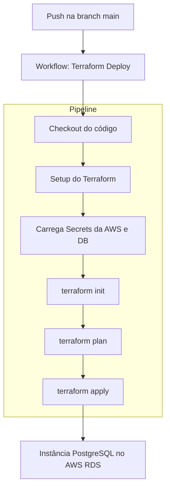

# FIAP Hackaton - Microsserviço de upload
Repositório com o microsserviço de upload para o hackathon

Este é o repositório que contém o código fonte do serviço de upload da aplicação [FIAP Hackathon](https://github.com/ns-fiap-tc/fiap_hackathon_doc). Nele você também encontrará arquivos de configuração do Terraform que fazem o deploy da aplicação na AWS.

<details>
  <summary>Detalhamento execução do projeto</summary>

## 👟 Passos para o provisionamento
Este projeto possui um ecossistema composto por múltiplos repositórios que se comunicam entre si e também utilizam GitHub Actions para provisionamento ou deploy automatizado.

> Para completo funcionamento da plataforma, é necessário seguir o seguinte fluxo de provisionamento:
> 1. A provisão do repositório da infra-base: [infra-base](https://github.com/ns-fiap-tc/fiap_hackathon_infra_base)
> 2. A provisão do repositório do banco de dados: [infra-bd](https://github.com/ns-fiap-tc/fiap_hackathon_infra_bd);
> 3. A provisão deste repositório: [fiap_hackathon_ms_upload](#como-rodar-o-projeto);
> 4. A provisão do repositório do microsserviço de notificação: [fiap_hackathon_ms_notificacao](https://github.com/ns-fiap-tc/fiap_hackathon_ms_notificacao);
> 5. A provisão do repositório do microsserviço de processamento: [fiap_hackathon_ms_processamento](https://github.com/ns-fiap-tc/fiap_hackathon_ms_processamento);
> 6. A provisão do repositório do microsserviço de extração de frames: [fiap_hackathon_ms_frameextractor](https://github.com/ns-fiap-tc/fiap_hackathon_ms_frameextractor);
> 7. A provisão do repositório para autenticação com cognito e api gateway: [fiap_hackathon_autenticacao](https://github.com/ns-fiap-tc/fiap_hackathon_autenticacao);

## 🚀 Como rodar o projeto

### 🤖 Via GitHub Actions
<details>
  <summary>Passo a passo</summary>

#### 📖 Resumo
Este repositório possui uma pipeline automatizada chamada `Terraform Deploy` que permite **provisionar a infraestrutura do serviço de upload** sempre que houver um push na branch `main`.

A branch é protegida e só aceita alterações que venham de PRs previamente aprovadas.

> ⚠️ Apenas usuários com acesso ao repositório e às **GitHub Secrets** corretas conseguem utilizar esse fluxo.

#### 🔐 Pré-requisitos
Certifique-se de que as seguintes **secrets** estejam configuradas no repositório do GitHub (`Settings > Secrets and variables > Actions`), por exemplo:
- `AWS_ACCESS_KEY_ID`
- `AWS_SECRET_ACCESS_KEY`
- `AWS_SESSION_TOKEN` *(se estiver usando AWS Academy)*
- `TF_VAR_DB_USERNAME`
- `TF_VAR_DB_PASSWORD`

Essas variáveis são utilizadas pelo Terraform para autenticação e execução dos planos na AWS.

#### ⚙️ Etapas da pipeline `Terraform Deploy`
1. 🧾 **Checkout do código**: A action clona este repositório.
2. ⚒️ **Setup do Terraform**: Instala a ferramenta na máquina runner.
3. 📂 **Acesso ao diretório atual**: Todos os arquivos `.tf` são lidos da raiz do repositório.
4. 🔐 **Carregamento das variáveis sensíveis** via secrets.
5. 🧪 **Execução do `terraform init`**: Inicializa o backend e os providers.
6. 🚀 **Execução do `terraform apply`**: Cria ou atualiza a instância de banco de dados no Amazon RDS.

#### 🧭 Diagrama do fluxo



#### Benefícios desse fluxo
- 🤖 Automatização do deploy do banco de dados
- ✅ Redução de erros manuais
- 🔐 Segurança no uso de credenciais via GitHub Secrets
- 🔁 Reprodutibilidade garantida
- 💬 Transparência nos logs via GitHub Actions

</details>

### 💻 Localmente

<details>
  <summary>Passo a passo</summary>

#### Pré-requisitos

Antes de começar, certifique-se de ter os seguintes itens instalados e configurados em seu ambiente:

1. **Terraform**: A ferramenta que permite definir, visualizar e implantar a infraestrutura de nuvem.
2. **AWS CLI**: A interface de linha de comando da AWS.
3. **Credenciais AWS válidas**: Você precisará de uma chave de acesso e uma chave secreta para autenticar com a AWS (no momento, o repositório usa chaves e credenciais fornecidas pelo [AWS Academy](https://awsacademy.instructure.com/) e que divergem de contas padrão). Tais credenciais devem ser inseridas no arquivo `credentials` que fica dentro da pasta `.aws`
4. **Bucket S3 criado na AWS convencional (que não seja na aws academy)**: Você precisará de uma chave de acesso e uma chave secreta para autenticar com a AWS e conectar ao S3. Tal abordagem foi necessária pois a AWS academy não permite a criação de roles e isso inviabilizou a comunicação dos serviços rodando no eks com o S3 da AWS academy. Com isso a solução foi criar um bucket com uma role específica para ele em um conta convencional da AWS

## Como usar

1. **Clonar o repositório**:

```bash
git clone https://github.com/ns-fiap-tc/fiap_hackathon_ms_upload
```

2. **Acesse o diretório do repositório clonado, por exemplo**:

```bash
cd fiap_hackathon_ms_upload
```

3. **Defina as variáveis necessárias ao nível de ambiente, criando um arquivo `.env` de acordo com o arquivo contido em cada repositório `.env.exemplo`. Exemplo:**:

```bash
DOCKERHUB_USERNAME="dockerhub_username"
DOCKERHUB_ACCESS_TOKEN="dokerhub_token"
```

4. **Inicialize o diretório Terraform**:

```bash
terraform init
```

5. **Visualize as mudanças que serão feitas**:

```bash
./terraform.sh plan
```

6. **Provisione a infraestrutura**:

```bash
./terraform.sh apply -auto-approve
```

7. **Para destruir a infraestrutura provisionada**:

```bash
./terraform.sh destroy -auto-approve
```
</details>
</details>

<details>
    <summary>Cobertura de Testes</summary>

## Cobertura de Testes
O projeto contém testes automatizados, abaixo evidência de cobertura dos testes.


</details>

## ✨ Contribuidores

- Guilherme Fausto - RM 359909
- Nicolas Silva - RM 360621
- Rodrigo Medda Pereira - RM 360575

## Licença

[](./LICENSE)
